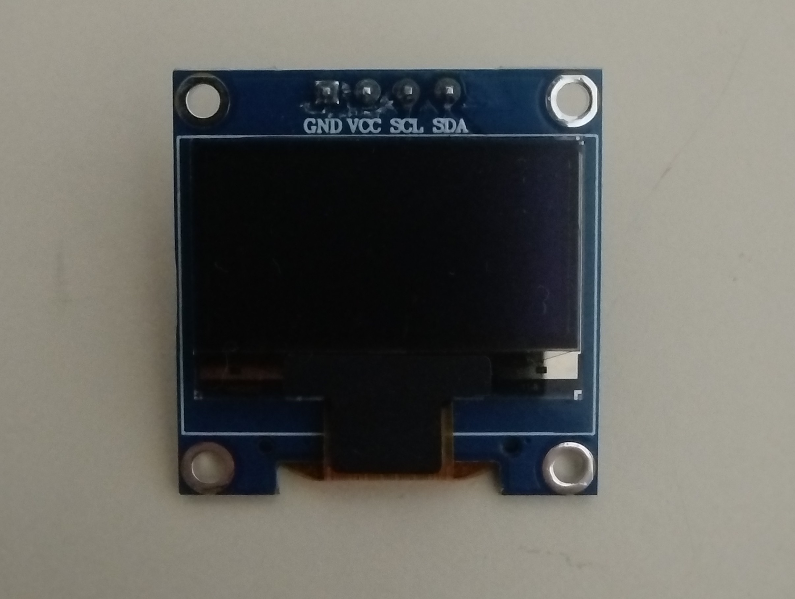
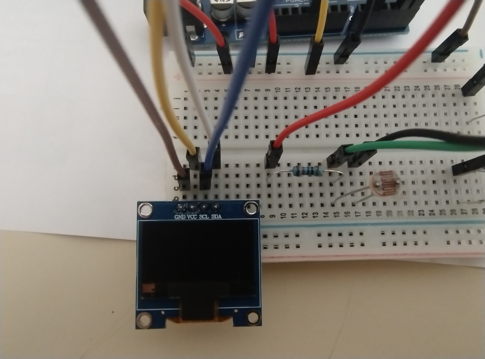
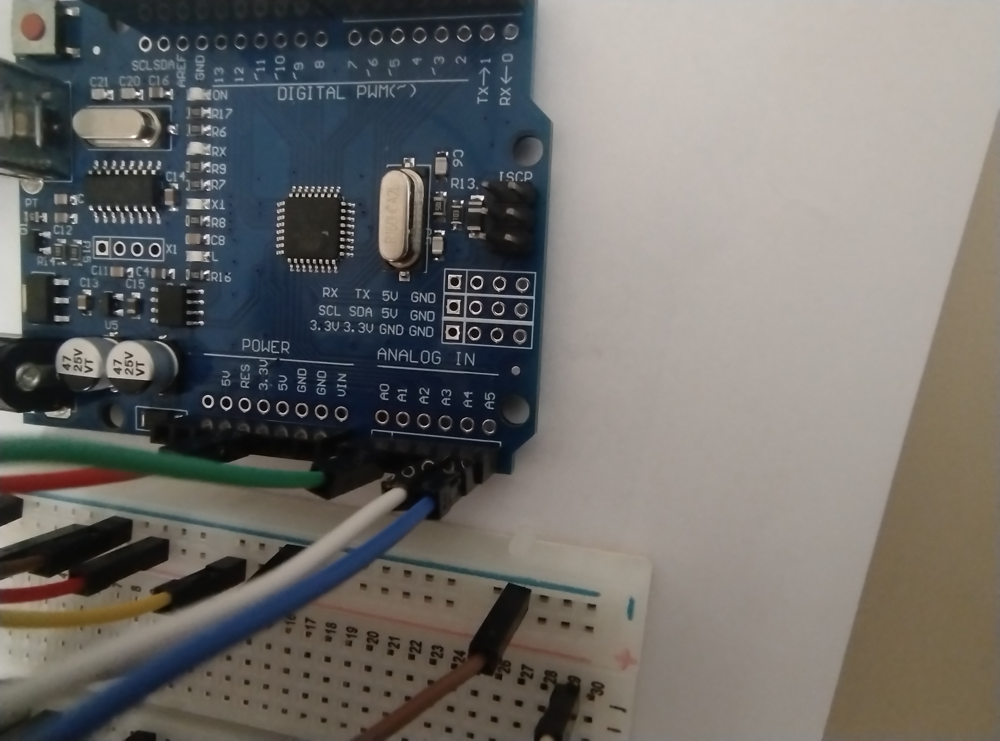
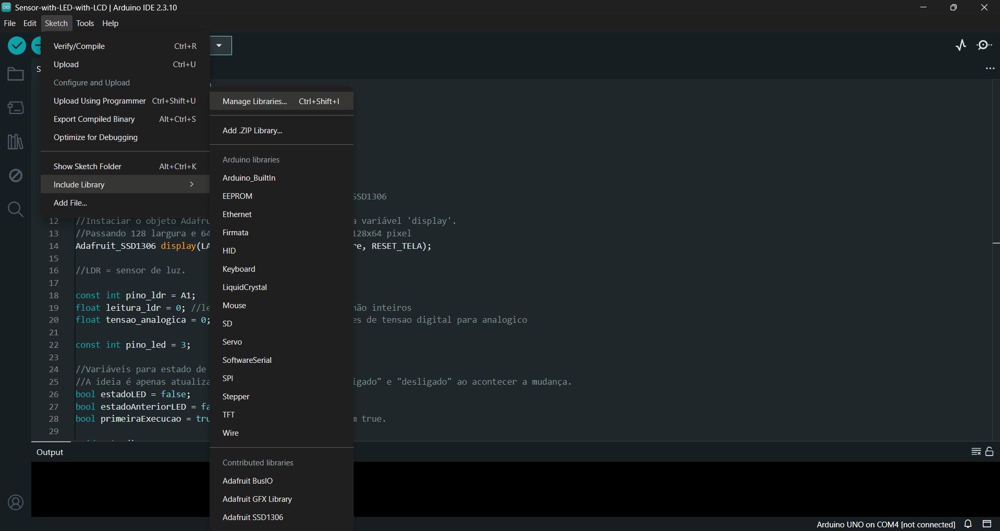
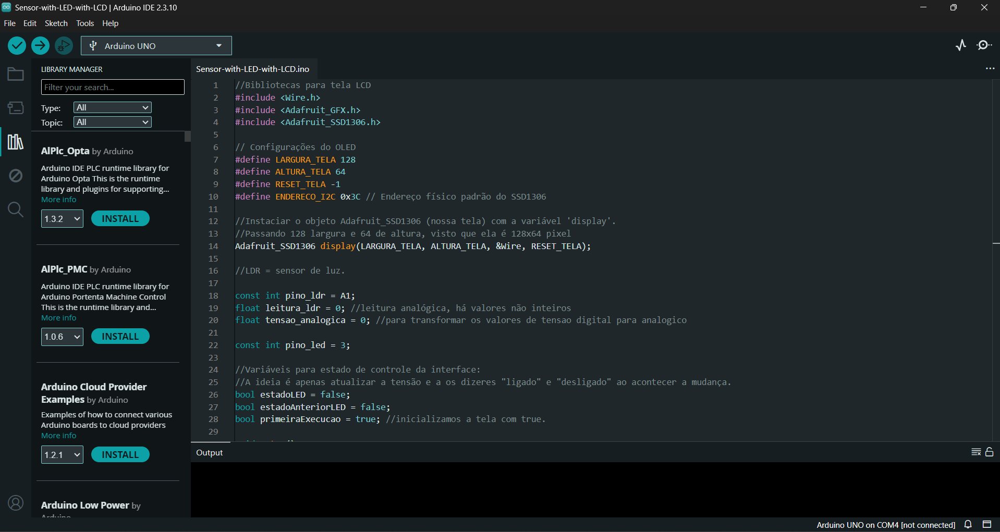

# Adicionando um display (mini tela OLED) no projeto
Infelizmente, não será possível demonstrar essa parte no simulador, dado a diferença entre a tela aqui usada e a tela disponível no [Thinkercad](https://www.tinkercad.com/dashboard).
Vamos adicionar uma tela no projeto do LDR. A mini tela terá a função de monitorar a tensão (aquela que é mostrada pelo multímetro do [Thinkercad](https://www.tinkercad.com/dashboard)) e mostrar se o LED está ligado ou desligado, de forma escrita.

## Hardware: conectando a tela OLED ao projeto
- O modelo da tela é um [módulo de tela OLED](https://pt.aliexpress.com/item/1005007551771400.html?spm=a2g0o.order_list.order_list_main.35.1b61caa4XXkVZo&gatewayAdapt=glo2bra) de quase 0,96 polegadas. É um módulo de exibição IIC OLED I2C azul de 128x64 pixel SSD1306 Mini.
- Nela, temos 4 entradas: GND, VCC, SCL e SDA.

1. O GND vai conectado a trilha GND advinda do Arduino.
2. O VCC é por onde o display é energizado. Ele recebe os 5V do Arduino.
3. O SCL (Serial Clock) é a sincronização de dados do display. No Arduino, o pino analógico A5 é a linha de clock para sincronizar dados. Portanto, o SCL deve ser conectado ao pino A5.
4. O SDA (Serial Data)deve ser conectado ao pino analógico A4 do Arduino. É por meio dela que os dados de imagem trafegam entre o display (SDA) e o Arduino (pino A4).

- Como a tela é diferente da usada no Thinkercad, deixo a imagem da conexão no circuito físico:

Repare nas cores. O fio azul está conectado ao SDL e ao pino A5, enquanto o fio branco está conectado ao SDA e ao pino A4.

## Software: explicações sobre programar a tela
- De início, vamos precisar instalar algumas bibliotecas específicas para esse modelo de tela, para que o código compile e o microcontrolador consiga renderizar os gráficos. Elas podem ser instaladas através da Arduino IDE.
- As bibliotecas que serão usadas:

1. ``<Wire.h>`` é uma biblioteca interna padrão do Arduino que gerencia o hardware de comunicação I2C. É ela que é responsável por trafegar os dados através dos pinos A4 (SDA) e A5 (SCL).
2. ``<Adafruit_GFX.h>`` (externa). Deve ser instalada. É uma biblioteca de processamento gráfico universal. Ela possui as rotinas matemáticas para desenhar pixels, linhas, círculos e escrever textos na memória.
3. ``<Adafruit_SSD1306.h>`` (externa). Deve ser instalada. É a biblioteca específica para a tela utilizada, que traduz os comandos visuais de ``<Adafruit_GFX.h>`` em sinais que o controlador SSD1306 entende.

- Para instalá-las, basta ir em 'Sketch' -> 'Include Library' -> 'Manage Libraries' e pesquisar as bibliotecas externas necessárias.

### Explicações sobre o código
- Vamos fazer algumas definições:

1. ``LARGURA_TELA = 128`` e ``ALTURA_TELA = 64``