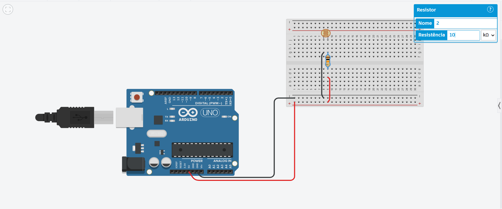
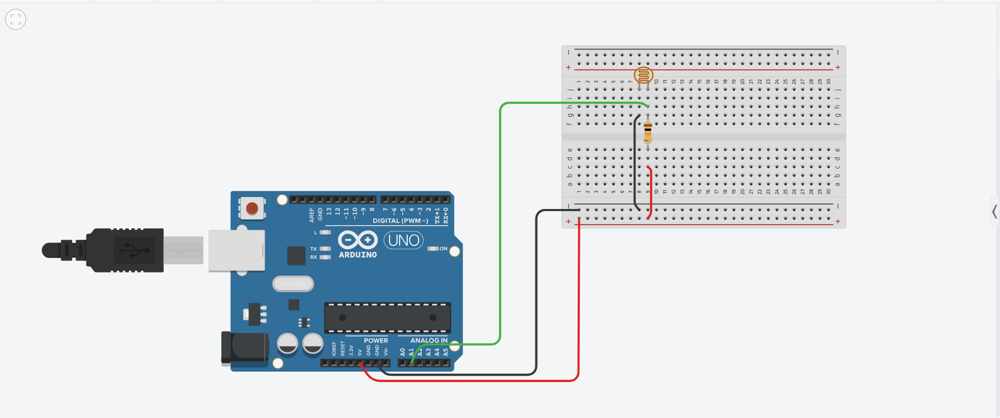
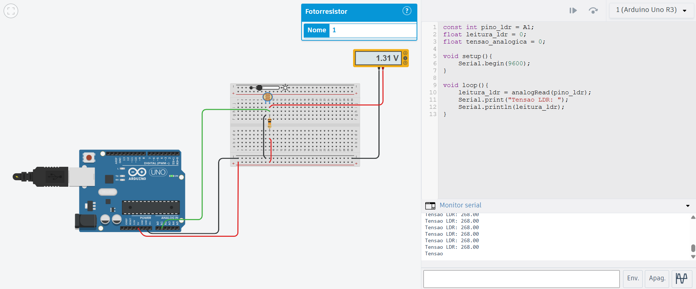
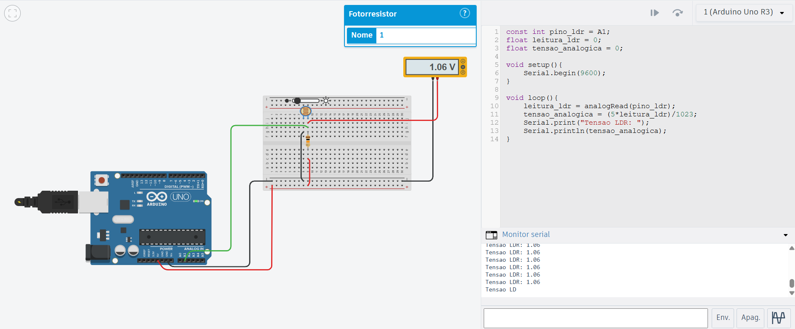
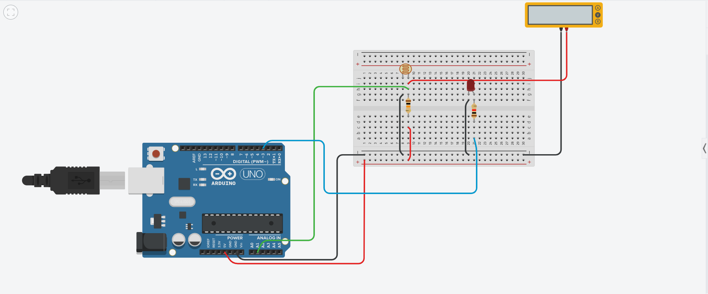
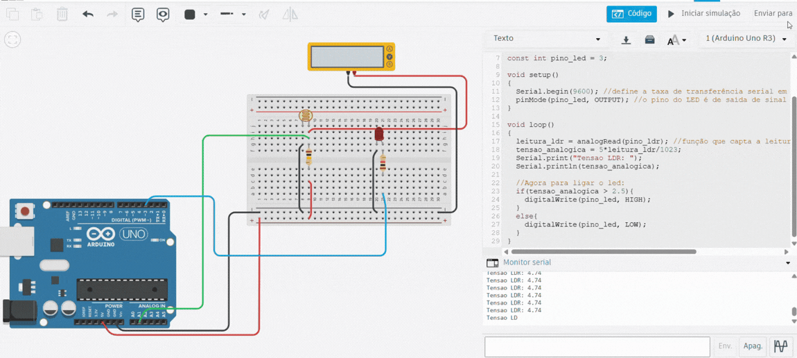

# Project Eletronics - Use an LDR sensor to turn on an LED
Projeto de eletrônica para demonstrar o uso de um sensor para acender um LED.
É importante salientar, antes de tudo, que algumas partes básicas de montagem do circuito serão ocultadas aqui, como funcionamento das trilhas de energia na protoboard, entre outras coisas.
Caso você não saiba ou não entenda o que foi feito, recomendo consultar o Projeto do [Semáforo](https://github.com/andreigomess/Basic-Project-Eletronics-Traffic-Light) que é mais básico e possui explicações básicas mais detalhadas.

# Ideia Central
A ideia central é utilizar um fotorresistor, de sigla LDR (do inglês Light Dependent Resistor) para acender um LED. Utilizando um Arduino Uno, ele receberá informações do sensor e com base nelas enviará um sinal para o LED ligar ou desligar.
As imagens serão novamente do [Thinkercad](https://www.tinkercad.com/dashboard), um simulador de projetos eletrônicos. É bastante útil também para ajudar a montar o projeto fisicamente, mitigando qualquer erro de conexão ou na montagem no circuito que possa ocorrer e consequentemente danificar algum componente.

## Componenetes de Software necessários:
- [Arduino IDE](https://www.arduino.cc/en/software/)

## Componentes de Hardware necessários:
- 1 Microcontrolador - Nesse caso, será usado o Arduino Uno
- 1 LED de qualquer cor - Nesse caso, usarei um branco
- 2 Resistores - sendo 1 de 10K Ohms e outro de 1,5K Ohms
- 1 Protoboard
- Jumpers Macho-Macho

# Hardware: alimentação do LDR e do LED
No [Thinkercad](https://www.tinkercad.com/dashboard), será demonstrado cada etapa da construção do circuito.

## 1. Energizando o LDR
- Primeiramente, pegue o Arduino e a Protoboard. Ligue o GND na trilha negativa e o 5V na trilha positiva. Dessa forma, teremos corrente elétrica, pois o GND é a referência 0V.
- Ligue uma das pernas do LDR ao GND e a outra ao 5V através de um Resistor de 10K Ohms. Para alterar o valor do Resistor no [Thinkercad](https://www.tinkercad.com/dashboard), basta clicar sobre ele e alterar o valor para 10 (verifique se está em K Ohms).
- O LDR não possui polaridade, ou seja, não é preciso tomar o cuidado de conectar o GND e o 5V cada um em uma perna específica.



Pronto, agora nosso LDR está energizado corretamente. Há um motivo específico para o uso de um Resistor de 10K Ohms, que será explicado no próximo tópico.

## 2. Captando os dados do LDR
- O LDR lerá a tensão com base na quantidade de luz (fótons) do ambiente. Quando maior a quantidade de luz, maior a resistência, quanto menor, menor será a resistência do LDR. Portanto, quanto menos luz, maior o valor da tensão e isso é o que ativará o LED.
- A leitura ta tensão não é digital, ou seja 0 ou 1. Ela é analógica, e para isso será usado uma das portas analógicas do Arduino.
- É aqui que entra também o uso do Resistor de 10K Ohms. O Resistor de 10K é o ideal aqui pois o LDR não é lido diretamente, o Arduino lê uma tensão. O LDR também um Resistor, um Fotorresistor que altera sua resistência conforme a quantidade de luz que incide sobre ele. No circuito que alimenta o LDR (5V -> Resistor Fixo -> LDR -> GND - e do LDR para o pino analógico), o melhor comportamento acontece quando esse Resistor Fixo (de 10K Ohms) se aproxima do valor médio de resistência do LDR. O LDR no geral "flutua" entre luz forte (que gera 1K Ohm de resistência) e luz fraca (que gera 100K Ohm de resistência), sendo a média 10K Ohms de resistência gerada. Isso gera um circuito equilibrado, capaz de ler de forma equilibrada todos os níveis de tensão advindos do LDR.
- O Arduino transforma a tensão contínua (analógica) em um número digital através do ADC (Analog to Digital Converter - Conversor Analógico-Digital). No caso do Arduino, o ADC possui 10 bits, ou seja, são 1024 níveis de valores diferentes, de 0 a 1023. Ao usar um Resistor de 10K Ohms (que é a média de tensão do LDR), significa que a faixa de valores do ADC que ele abrange é maior, pois a diferença seria de 512 (justamente a média) para mais e para menos. Se fosse usado um Resistor de 1.5K Ohms por exemplo, o valor médio dele no ADC seria bem menor que 512, o que dificultaria a leitura de valores maiores de tensão (que gerariam valores no ADC próximos de 1023). Portanto, o uso de um Resistor de 10K Ohms é o mais recomendado, para uma melhor leitura de tensão pelo ADC.
- Passadas explicações, vamos conectar o LDR na entrada analógica do Arduino. A trilha que recebe a corrente de 5V através do resistor é a que será utilizada para conectar a entrada analógica. Conectamos ao pino A1.



- Para uma visualização da captação de dados do LDR, vamos fazer uma pequena programação e verificar no monitor serial do Arduino essa leitura. Com ela, vamos verificar o valor de tensão que entrada no pino analógico.
- Na [Arduino IDE](https://www.arduino.cc/en/software/), abra um novo programa e crie a seguintes variáveis:
```
const int pino_ldr = A1;
float leitura_ldr = 0;
float tensao_analogica = 0;
```
A tensão analógica é para transformar a leitura do LDR (```leitura_ldr```) em um valor de tensão (```tensao_analogica```) que será lido.

- Nas funções principais do Arduino, faremos:
```
void setup(){
    Serial.begin(9600);
}

void loop(){
    leitura_ldr = analogRead(pino_ldr);
    Serial.print("Tensao LDR: ");
    Serial.println(leitura_ldr);
}
```
A ```leitura_ldr``` recebe a leitura analógica de ```pino_ldr```, que nesse caso, é o A1. Como foi explicado antes, o ADC transforma a tensão contínua em um valor digital. Ao rodar o comando o jeito que está, perceba que a leitura não será igual a do multímetro. Isso acontece porque o valor dado pelo ADC na sua resolução de 10 bits, ou seja, números de 0 a 1023, mas o valor varia de 0 a 5V. Veja a imagem:



- Portanto, é necessário um ajuste proporcional para a visualização correta da tensão. Isso pode ser feito por uma regra de 3 básica, onde 5V equivale a 1023 e ```tensao_analogica```, que é digital, equivale a ```leitura_ldr```, que é analógica. Dessa forma, teremos: ```tensao_analogica = (5*leitura_ldr)/1023```. Basta adicionar isso ao código e trocar o comando para ``Serial.println(tensao_analogica)``. Dessa forma, teremos:



## 3. Ligar o LED
- Agora é a hora de ligar o LED. Como é de conhecimento prévio, o LED possui polaridade: O ânodo (perna maior) recebe a energia e o cátodo (perna menor) recebe o GND para fluir corrente.
- A ligação é simples: o GND vai no cátodo e o ânodo é energizado através de um pino digital do Arduino (fio azul), através de um resistor (nesse caso, será usado um 1,5K Ohms).



# Software: programando o acendimento automático do LED com base na luz
A parte de programação do LDR foi mais descrita dentro do tópico acima de Hardware, pois ficaria muito estranho explicar o software e o hardware ali de forma separada. Aqui, será demonstrado a programação do LED e o código final.

## 1. Definindo o pino do LED e programando
- O pino do LED escolhido é o pino 3 digital do Arduino. Declaramos ``const int pino_led = 3;``
- Dentro de ``setup()``, definimos o pino do LED como saída: ``pinMode(pino_led, OUTPUT);``
- Dentro de ``loop()``, será realizada a lógica de controle do LED: a decisão tomada foi de ligar o LED com base em uma leitura de ``tensao_analogica`` maior que 2.5V e desligar caso a leitura seja abaixo disso.

## 2. Código final
- Dessa forma, o código fica:
```
//LDR = sensor de luz.

const int pino_ldr = A1;
float leitura_ldr = 0; //leitura analógica, há valores não inteiros
float tensao_analogica = 0; //para transformar os valores de tensao digital para analogico

const int pino_led = 3;

void setup()
{
  Serial.begin(9600); //define a taxa de transferência serial em bit/s
  pinMode(pino_led, OUTPUT); //o pino do LED é de saída de sinal elétrico
}

void loop()
{
  leitura_ldr = analogRead(pino_ldr); //função que capta a leitura do pino_ldr (nesse caso, A3)
  tensao_analogica = (5*leitura_ldr)/1023;
  Serial.print("Tensao LDR: ");
  Serial.println(tensao_analogica);
  
  //Agora para ligar o led:
  if(tensao_analogica > 2.5){
  	digitalWrite(pino_led, HIGH);
  }
  else{
    digitalWrite(pino_led, LOW);
  }
}
```

# Vídeos do projeto

## Simulador (Thinkercad):



## Real (Físico):

